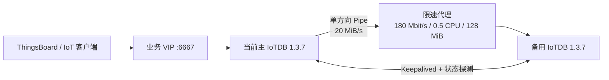

# 项目文档

本目录记录 ThingsBoard 4.1 IoTDB 增强分支的安装、设计、压测、现场验收和运维方法。
首次使用建议按下面顺序阅读。

## 入门与运维

1. [安装与部署指南](INSTALLATION.md)：开发环境、构建、单机 IoTDB、双机 HA、应用接入。
2. [日常运维与故障处理](OPERATIONS.md)：状态检查、切换、限速、备份、升级和回滚。
3. [IoTDB 1.3.7 双机自动热备实施手册](IoTDB-1.3.7双机自动热备实施手册.md)：
   现场拓扑、状态机、安全边界与真实验收证据。

## IoTDB 设计与容量

| 文档 | 用途 |
|---|---|
| [IoTDB 技术设计文档](IoTDB技术设计文档.md) | ThingsBoard 时序模型、写入和查询实现 |
| [IoTDB 集成影响分析](IoTDB集成影响分析.md) | 模块改动与兼容影响 |
| [IoTDB 时序存储集成设计与压测报告](IoTDB时序存储集成设计与压测报告.md) | DAO 路径和性能验证 |
| [IoTDB 参数调优指南](IoTDB参数调优指南.md) | JVM、内存、线程、flush 和 compaction |
| [IoTDB 四机容量实测矩阵](IoTDB四机容量实测矩阵.md) | 多节点实测对比 |
| [IoTDB 全机械盘六类负载容量报告](IoTDB全机械盘六类负载容量报告.md) | 机械盘场景的容量边界 |

## 阅读约定

- 文档中的 `10.8.8.65/66/67` 是已验证现场拓扑，不是强制地址。
- 命令默认从仓库根目录执行，特别说明除外。
- 所有密码、令牌、证书私钥都必须通过服务器密钥文件或外部秘密管理系统注入。
- 容量数字必须结合 CPU、内存、磁盘类型、测点变化率和业务延迟要求重新验收。


# ThingsBoard 4.1 IoTDB Edition

[](LICENSE)
[](pom.xml)
[](docker/iotdb/ha/README.md)
[](https://github.com/bcblr1993/thingsboard-4.1-iotdb-ha/actions/workflows/repository-smoke.yml)

这是一个基于 [ThingsBoard Community Edition 4.1](https://github.com/thingsboard/thingsboard)
的增强分支，重点提供 Apache IoTDB 时序存储接入、批量写入优化、容量测试文档，
以及已经在两台 Linux 服务器上完成故障切换验证的 IoTDB 1.3.7 自动热备方案。

本仓库不是 ThingsBoard 或 Apache IoTDB 官方发行版。通用 ThingsBoard 问题请优先
参考上游文档；本仓库的 Issue 用于跟踪 IoTDB 集成、HA 交付物和本分支改动。

## 主要能力

- ThingsBoard 遥测历史库和最新值存储支持 `iotdb` 类型。
- IoTDB `SessionPool`、aligned tablet 批量写入、分片缓冲、背压和统计日志。
- IoTDB 1.3.7 standalone、3C3D 集群以及双机自动主备部署材料。
- Keepalived VIP、短租约 fencing、单方向 Pipe 和故障后的同步方向自动反转。
- Pipe 与网络代理双层限速，避免历史追平占满业务链路。
- 机械盘容量矩阵、参数调优、集成影响和现场验收文档。

## 已验证基线

| 项目 | 版本或结果 |
|---|---|
| ThingsBoard | `4.1.0` |
| Java | `17` |
| 前端工具链 | Node.js `20.18.0`、Yarn `1.22.22`（由 Maven 插件管理） |
| Apache IoTDB | `1.3.7` |
| HA 形态 | 两台 standalone，单主写入，Pipe 方向自动反转 |
| 业务入口 | VIP `10.8.8.65:6667`（现场验证拓扑，可在 `node.env` 修改） |
| A → B VIP 接管 | 约 `0.852 s` |
| B → A VIP 接管 | 约 `0.714 s` |
| 同步带宽实测 | `173.45 Mbit/s`，配置硬上限 `180 Mbit/s`，丢包 `0` |
| 最终数据校验 | 两端 `count=5, sum=150, max_time=5000` |

现场数字只代表 2026-07-14 的验收环境，不应直接当作其他硬件的容量承诺。

## HA 架构



任意时刻只允许当前 VIP 主节点创建 outgoing Pipe。故障后，新主先承接写入；旧主
恢复为备机后，由新主创建反向 history + realtime Pipe 完成追平。禁止同时运行
A→B 和 B→A，避免 Pipe 数据回环。

## 快速开始

### 1. 获取代码

```bash
git clone https://github.com/bcblr1993/thingsboard-4.1-iotdb-ha.git
cd thingsboard-4.1-iotdb-ha
```

### 2. 本地启动单机 IoTDB

```bash
docker compose -f docker/iotdb/docker-compose-standalone.yml up -d
docker compose -f docker/iotdb/docker-compose-standalone.yml ps
```

本地联调可以使用默认账户；生产环境必须轮换密码并通过受限的环境变量或密钥文件
注入，禁止把真实凭据提交到 Git。

### 3. 配置 ThingsBoard 使用 IoTDB

```bash
export DATABASE_TS_TYPE=iotdb
export DATABASE_TS_LATEST_TYPE=iotdb
export IOTDB_NODE_URLS=10.8.8.65:6667
export IOTDB_USER='<iotdb-user>'
export IOTDB_PASSWORD='<from-secret-store>'
export IOTDB_DATABASE=root.tb
```

双机模式下 `IOTDB_NODE_URLS` 只填写 VIP，不要同时填写两个物理 IP。若最新值仍由
Redis 承担，可把 `DATABASE_TS_LATEST_TYPE` 保持为 `redis`。

### 4. 构建 ThingsBoard

```bash
mvn clean install -DskipTests
```

主要应用包生成在 `application/target/`。完整依赖、首次安装、IoTDB 镜像构建和
双机上线顺序见 [安装与部署指南](docs/INSTALLATION.md)。

### 5. 部署 IoTDB 双机 HA

```bash
cd docker/iotdb/ha
cp node.env.example node.env
# 修改节点身份后，通过 /srv/iotdb-ha/secrets/ 提供密码。
./bin/ha-compose.sh config
./bin/ha-compose.sh up -d
docker exec iotdb-ha /opt/iotdb-ha/bin/ha-status.sh
```

首次上线必须先启动 A，确认 `MASTER_SOLO` 和 VIP 正常，再启动 B。完整操作、验收、
回滚与故障边界见
[IoTDB 1.3.7 双机自动热备实施手册](docs/iotdb/IoTDB-1.3.7双机自动热备实施手册.md)。

## 文档索引

- [安装与部署指南](docs/INSTALLATION.md)
- [日常运维与故障处理](docs/OPERATIONS.md)
- [文档总目录](docs/README.md)
- [IoTDB 1.3.7 双机自动热备实施手册](docs/iotdb/IoTDB-1.3.7双机自动热备实施手册.md)
- [IoTDB 技术设计文档](docs/iotdb/IoTDB技术设计文档.md)
- [IoTDB 参数调优指南](docs/iotdb/IoTDB参数调优指南.md)
- [IoTDB 四机容量实测矩阵](docs/iotdb/IoTDB四机容量实测矩阵.md)
- [变更记录](CHANGELOG.md)

## 目录说明

| 路径 | 内容 |
|---|---|
| `application/` | ThingsBoard 启动应用及主配置 |
| `dao/` | IoTDB DAO、写缓冲和基准工具 |
| `docker/iotdb/` | IoTDB standalone、集群与 HA 部署文件 |
| `docker/iotdb/ha/bin/` | HA 状态机、fencing、健康检查和限速代理脚本 |
| `docs/iotdb/` | 设计、调优、容量和现场验收文档 |
| `.github/` | CI、Issue、PR、依赖更新和代码所有者配置 |

## 生产使用边界

- Pipe 是异步复制，不是同步提交，RPO 不能严格保证为零。
- IoTDB 1.3.7 Pipe 不负责同步删除和 TTL 运维动作；此类变更必须在两端执行一致流程。
- 两节点完全网络分区没有多数派。若必须同时保证持续写入和绝不双主，需要增加第三见证节点。
- 投产前必须轮换 IoTDB 默认管理密码、备份两端数据，并演练 VIP 切换与回滚。
- 应用只能连接 VIP；HA 的物理节点端口由 fencing 规则阻止普通客户端直写。

## 参与开发

请先阅读 [CONTRIBUTING.md](CONTRIBUTING.md)。提交前至少运行：

```bash
bash -n docker/iotdb/ha/bin/*.sh
cp docker/iotdb/ha/node.env.example docker/iotdb/ha/node.env
docker compose --env-file docker/iotdb/ha/node.env \
  -f docker/iotdb/ha/docker-compose.yml config --quiet
rm docker/iotdb/ha/node.env
git diff --check
```

安全问题不要创建公开 Issue，请按 [.github/SECURITY.md](.github/SECURITY.md) 提交。

## 上游与许可证

本项目保留 ThingsBoard 原有版权和 [Apache License 2.0](LICENSE)。上游产品文档：
[thingsboard.io/docs](https://thingsboard.io/docs/)。对本分支的修改同样按仓库许可证分发。
