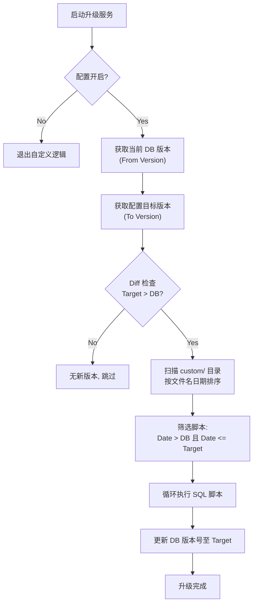
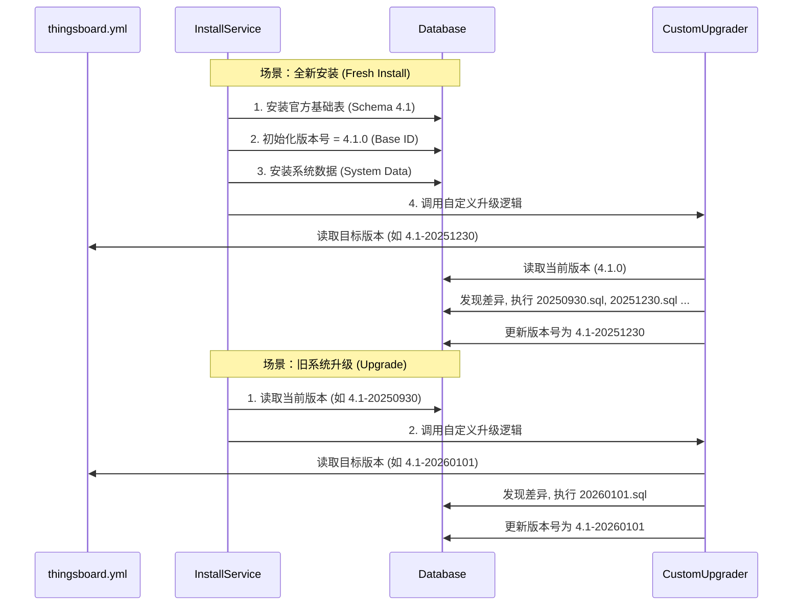

# ThingsBoard 自定义增量升级系统设计文档

## 1. 设计概述

本方案旨在为 ThingsBoard 4.1 提供一套**非侵入式**、**可配置**且**支持增量回放**的自定义升级机制。它允许开发团队使用日期版本号（如 `20251230`）来管理私有功能的数据库变更，同时无缝兼容官方的语义化版本。

### 核心特性
*   **非侵入性 (Non-Intrusive)**: 核心逻辑仅在开关开启时生效，不影响官方标准升级路径。
*   **混合版本存储 (Hybrid Versioning)**: 使用特制的算法将 "官方版本 + 日期" 映射为数据库可存储的 `BIGINT`，实现与官方版本号的共存。
*   **全场景覆盖**: 统一支持 **"旧版升级"** 和 **"全新安装"** 两种场景，无需维护两套 SQL。
*   **自动回放 (Auto-Replay)**: 系统根据当前数据库状态，自动计算并执行缺失的中间增量脚本。

---

## 2. 系统架构与流程

### 2.1 版本号设计 (Hybrid ID)

为了在数据库的 `schema_version` (BigInt 类型) 中同时存储官方版本和自定义日期，我们采用 **分段位移算法**。

*   **格式**: `官方版本-日期` (推荐，如 `4.1-20251230`)
*   **ID 计算公式**:
    $$ ID = (Major \times 10^{11}) + (Minor \times 10^8) + Date $$
    *   `Major` (主版本): 如 4
    *   `Minor` (次版本): 如 1
    *   `Date` (日期): 如 20251230 (8位数字)

*   **示例**: `4.1-20251230` -> `400120251230`

### 2.2 逻辑流程图

#### A. 核心升级逻辑流程


#### B. 全新安装 vs 升级场景


---

## 3. 配置说明

在 `application/src/main/resources/thingsboard.yml` 中配置：

```yaml
install:
  upgrade:
    # [必填] 开启自定义策略开关
    custom_strategy_enabled: true
    
    # [必填] 设置您发布的目标版本
    # 格式推荐: 官方版本-日期 (分界清晰)
    # 示例: 4.1-20251230
    custom_version: "4.1-20251230"
```

---

## 4. 开发与发布实战指南 (SOP)

### 4.1 目录结构
所有自定义 SQL 脚本必须存放在以下目录：
```text
application/src/main/data/upgrade/custom/
```

### 4.2 脚本命名规范
```text
upgrade_<官方版本>-<日期>.sql
```
*   示例 1: `upgrade_4.1-20250930.sql` (推荐)
*   示例 2: `upgrade_4.2.1-20251230.sql` (如果基线升级了)

### 4.3 日常开发流程

#### 场景一：开发一个包含数据库变更的新功能
假设当前版本 `4.1-20250930`，您要开发 `20251230` 版本，包含一张新表 `device_report`。

1.  **编写脚本**: 
    在 `custom/` 目录下新建 `upgrade_4.1-20251230.sql`。
    ```sql
    CREATE TABLE IF NOT EXISTS device_report ( ... );
    ```
2.  **提交代码**: 将 SQL 文件提交到 Git。
3.  **修改配置 (仅在发布时)**: 
    将 `thingsboard.yml` 中的 `custom_version` 改为 `4.1-20251230`。
4.  **构建部署**: 打包发布。

#### 场景二：开发仅包含代码逻辑的新功能 (无 SQL)
假设您修复了一个 Bug，版本定为 `20260101`，但没有动数据库。

1.  **无需脚本**: 不需要创建任何 `.sql` 文件。
2.  **修改配置**: 将 `thingsboard.yml` 中的 `custom_version` 改为 `4.1-20260101`。
3.  **构建部署**: 打包发布。
    *(注: 系统启动时会发现没有 SQL 需要执行，直接把数据库版本号更新为 400120260101)*

#### 场景三：官方大版本升级 (例如 4.1 -> 4.2)
假设官方发布了 ThingsBoard 4.2，您需要跟进升级，同时保留您的自定义功能。

1.  **代码合并**: 将官方 4.2 分支的代码合并到您的 Fork 仓库中。
    *   *(注: 官方 4.2 的 `application/src/main/data/upgrade/basic/schema_update.sql` 会包含官方的升级变更，请务必保留)*
2.  **准备自定义脚本**: 
    如果您在合并过程中发现需要对您的私有表做适配，请创建 `upgrade_4.2-20260501.sql`。
    如果不需要额外变更，则无需创建。
3.  **修改配置**:
    将 `thingsboard.yml` 更新为新基线：
    ```yaml
    custom_version: "4.2-20260501" 
    # 注意: 日期必须比当前 DB 里的日期更新，才能触发版本刷新
    ```
4.  **执行升级**:
    系统会自动执行两步：
    1.  **官方升级**: `ThingsboardInstallService` 自动执行官方基础升级脚本 (将核心表升至 4.2)。
    2.  **增量升级**: 我们的系统识别到目标是 `4.2-20260501`，自动更新数据库版本号，并执行您可能添加的 `upgrade_4.2-....sql`。

---

## 5. 常见问题 (FAQ)

**Q1: 我在本地开发时，需要手动改数据库里的版本号吗？**
A: 不需要。您只需要改 `thingsboard.yml` 配置，重启服务，系统会自动帮您更新数据库里的版本号。

**Q2: 为什么首次安装不需要我改 schema.sql？**
A: 这是本设计的一大亮点。系统会在安装完官方基础 schema 后，立即运行一次“自我升级”逻辑，把您放在 `custom/` 目录下的所有脚本都跑一遍。这样您只需要维护一份增量脚本，避免了代码冲突。

**Q3: 如果我配置写错了（比如日期写小了），会怎样？**
A: 如果 `配置的目标日期 <= 数据库当前日期`，系统会认为“无需升级”，直接跳过，不会有任何副作用。
